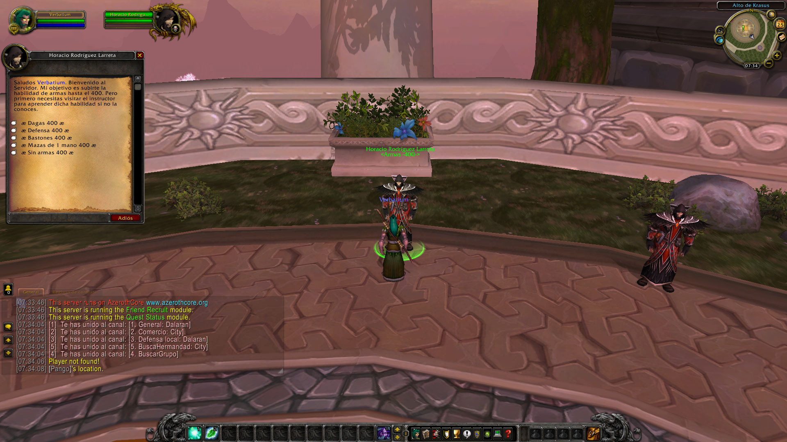
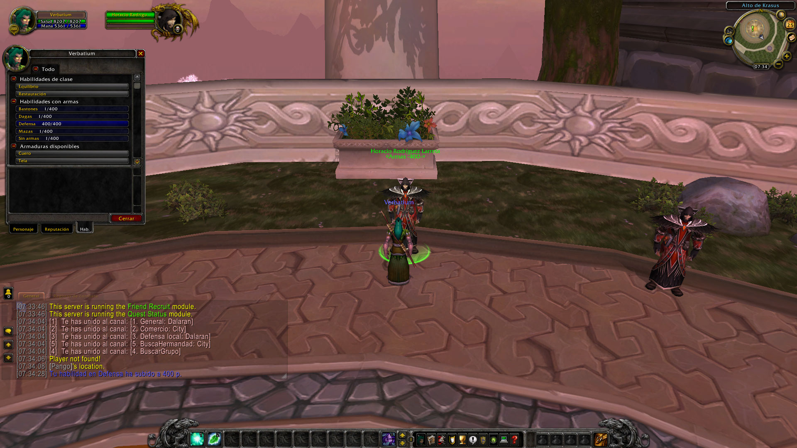

#  AzerothCore

### NPC armas

El script tiene como objetivo, subirle las skill al jugador, hasta el nivel máximo (400) pero el jugador, debe conocer previamente el spell. Por lo que debe visitar al instructor de armas, aprenderla y entonces hablar con el npc que le subirá dicha skill.

El script está pensando para servidor que se encuentren en fase BETA principalmente, donde los jugadores necesitas probar el contenido antes del inicio del servidor, pero también es válido para servidores instance 80.

- [x] ARCOS
- [x] DAGAS
- [x] DEFENSA
- [x] ARMA DE ASTA
- [x] MAZAS
- [x] MAZAS DE DOS MANOS
- [x] ARMAS DE FUEGO
- [x] ESPADAS
- [x] ESPADAS DE DOS MANOS
- [x] VARITAS
- [x] HACHAS
- [x] HACHAS DE DOS MANOS
- [x] BASTONES
- [x] BALLESTAS
- [x] ARMAS ARROJADIZAS
- [x] SIN ARMAS
