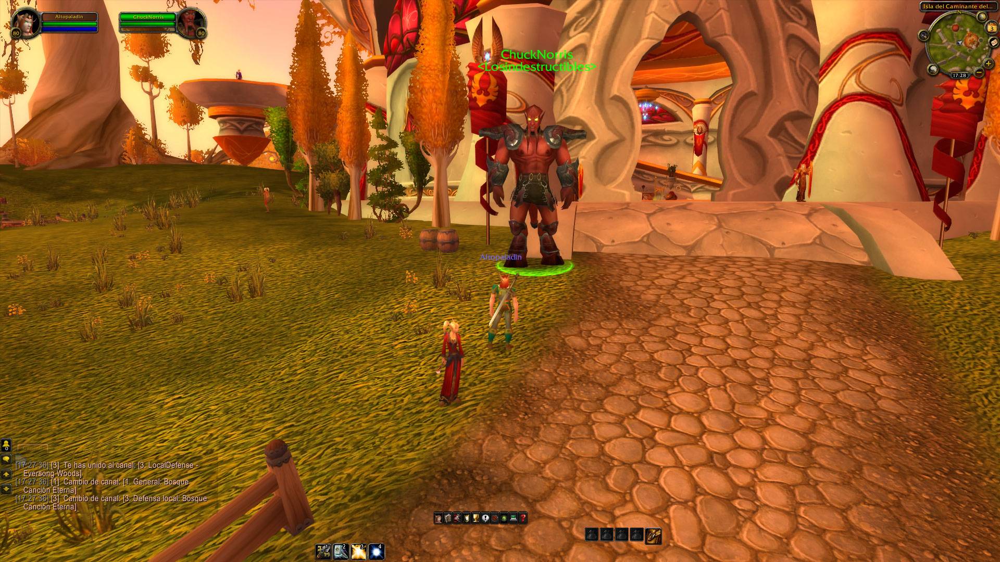
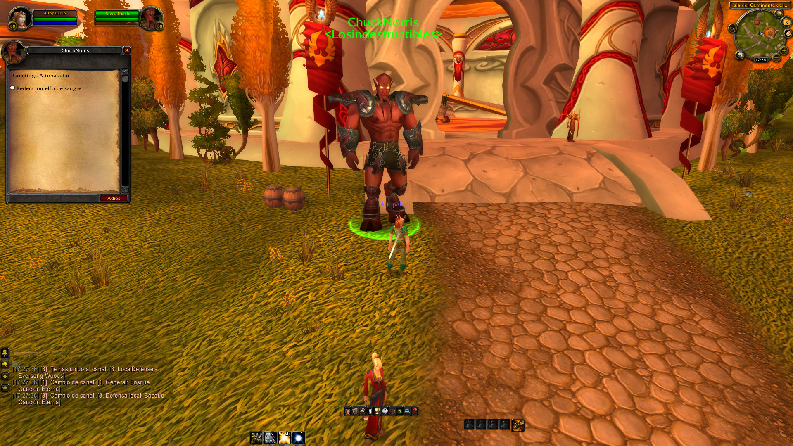

### Quest clase

Es un script en lua, que le permite a los jugadores, completar las misiones de clase y recibir los spells correspondiente, sin la necesidad de tener que hacer dichas misiones. Por ejemplo:

- Revivir del paladín
- Las transformaciones del druida
- Las mascotas del cazador

> Entre otras cosas

